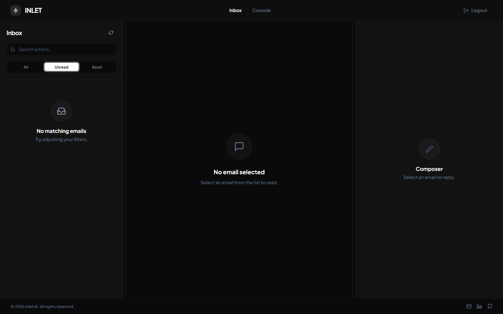
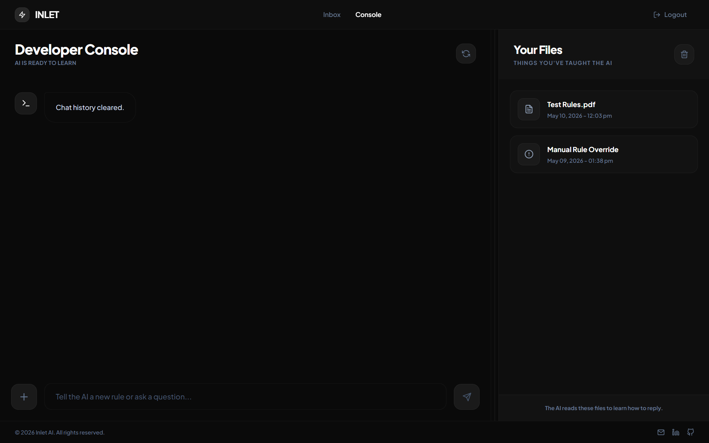

# Inlet — Autonomous AI Support Platform

Inlet is a production-ready B2B SaaS platform that automates customer support using AI. It connects directly to your Gmail inbox, uses a RAG (Retrieval-Augmented Generation) pipeline to draft intelligent, policy-grounded email replies, and provides a knowledge management console where you can train the AI on your company's documents and rules.

---

## Features

- **Live Inbox Sync** — Connects to Gmail via the Google API and polls for new customer emails every 15 seconds, displaying them in a real-time inbox view.
- **AI Reply Drafting** — For any selected email, the AI queries your private knowledge base and drafts a professional, empathetic reply grounded in your company's policies. It never makes up answers it wasn't trained on.
- **Email Composer** — A built-in Write/Preview editor with Markdown support lets you review, edit, and send AI-drafted replies directly from the platform.
- **Knowledge Management Console** — A chat interface where you can upload PDF documents (e.g., refund policies, product manuals) to train the AI's memory using a PGVector-backed RAG system.
- **Manual Rule Override** — Chat with the AI directly to add, update, or remove specific support rules in real-time. The AI uses a function-calling tool to persist changes to the database instantly.
- **Secure Authentication** — User login powered by Supabase Auth (JWT-based). All routes are protected by server-verified sessions; bypassing authentication via browser manipulation is not possible.
- **Global Toast Notifications** — Non-blocking, polished toast notifications replace all native browser alerts.

---

## Screenshots

**Inbox — AI-Powered Email Triage**


**Console — Knowledge Management & AI Training**


---

## Tech Stack

| Layer | Technology |
|---|---|
| **Frontend** | React 19, Vite, Tailwind CSS |
| **Backend** | Java 17, Spring Boot 3.3 |
| **AI / LLM** | NVIDIA NIM (Mistral Small), Spring AI |
| **Embeddings** | Mistral AI (`mistral-embed`) |
| **Vector Store** | PGVector (via Supabase PostgreSQL) |
| **Database** | Supabase PostgreSQL |
| **Authentication** | Supabase Auth |
| **Email Integration** | Google Gmail API (OAuth 2.0) |

---

## Prerequisites

Before you begin, ensure you have the following installed:

- **Java 17** (exact version required) — [Download Adoptium Temurin 17](https://adoptium.net/temurin/releases/?version=17)
- **Maven** — Bundled via the `mvnw` wrapper, no separate install needed.
- **Node.js 18+** — [Download Node.js](https://nodejs.org/)
- **Git**

You will also need accounts and credentials for:

- [Supabase](https://supabase.com/) — For the database, PGVector store, and authentication.
- [NVIDIA NIM](https://build.nvidia.com/) — For the LLM chat model.
- [Mistral AI](https://console.mistral.ai/) — For the embedding model.
- [Google Cloud Console](https://console.cloud.google.com/) — For Gmail API access (OAuth 2.0 credentials).

---

## Project Structure

```
Inlet/
├── core/                          # Java Spring Boot Backend
│   ├── src/
│   │   └── main/
│   │       ├── java/com/inlet/core/
│   │       │   ├── config/        # CORS configuration
│   │       │   ├── exception/     # Global exception handler
│   │       │   ├── extraction/    # Gmail integration & ticket scanning
│   │       │   └── knowledgebase/ # RAG pipeline, AI tools, PDF ingestion
│   │       └── resources/
│   │           ├── application.properties
│   │           └── credentials.json   ← Place your Gmail OAuth file here
│   ├── .env                       ← Create this file (see below)
│   ├── .gitignore
│   └── pom.xml
│
└── Inlet/                         # React/Vite Frontend
    ├── src/
    │   ├── config/
    │   │   ├── api.js             # API endpoint definitions
    │   │   └── supabaseClient.js  # Supabase client (reads from .env)
    │   ├── layouts/
    │   │   └── MainLayout.jsx
    │   ├── pages/
    │   │   ├── LoginPage.jsx
    │   │   ├── InboxPage.jsx
    │   │   └── KnowledgePage.jsx
    │   └── components/
    │       ├── ChatArea.jsx
    │       └── HistorySidebar.jsx
    ├── .env                       ← Create this file (see below)
    ├── .gitignore
    └── package.json
```

---

## Installation & Setup

### Step 1 — Clone the Repository

```bash
git clone https://github.com/Elangovan2006M/Inlet.git
cd Inlet
```

---

### Step 2 — Gmail API Credentials

1. Go to the [Google Cloud Console](https://console.cloud.google.com/).
2. Create a new project, then go to **APIs & Services > Library** and enable the **Gmail API**.
3. Go to **APIs & Services > Credentials**, click **Create Credentials > OAuth client ID**.
4. Choose **Desktop App** as the application type and download the JSON file.
5. **Rename the file to exactly `credentials.json`** and place it in the following path:

```
core/src/main/resources/credentials.json
```

> This file is listed in `.gitignore` and will never be committed to the repository.

---

### Step 3 — Backend Environment Setup

Create a `.env` file inside the `core/` directory (the same level as `pom.xml`):

```
core/.env
```

Paste the following content and fill in your values:

```env
# NVIDIA NIM — LLM Chat Model
NVIDIA_API_KEY=your_nvidia_nim_api_key_here

# Mistral AI — Embedding Model
MISTRAL_API_KEY=your_mistral_api_key_here

# Supabase PostgreSQL Database
DB_URL=jdbc:postgresql://db.YOUR_PROJECT_REF.supabase.co:5432/postgres
DB_USERNAME=postgres
DB_PASSWORD=your_supabase_database_password_here

# Supabase Auth (Service Role Key)
SUPABASE_URL=https://YOUR_PROJECT_REF.supabase.co
SUPABASE_KEY=your_supabase_service_role_key_here

# Frontend URL for CORS (change to your production domain when deploying)
FRONTEND_URL=http://localhost:5173
```

> **Where to find these values:**
> - `NVIDIA_API_KEY` → [build.nvidia.com](https://build.nvidia.com/) > Your API Keys
> - `MISTRAL_API_KEY` → [console.mistral.ai](https://console.mistral.ai/) > API Keys
> - `DB_URL`, `DB_USERNAME`, `DB_PASSWORD` → Supabase Dashboard > Project Settings > Database
> - `SUPABASE_URL`, `SUPABASE_KEY` (Service Role) → Supabase Dashboard > Project Settings > API

---

### Step 4 — Frontend Environment Setup

Create a `.env` file inside the `Inlet/` directory (the same level as `package.json`):

```
Inlet/.env
```

Paste the following content and fill in your values:

```env
# Backend API Base URLs
VITE_TRAINING_BASE_URL=http://localhost:8080/api/v1/training
VITE_TICKETS_BASE_URL=http://localhost:8080/api/v1/tickets

# Supabase (Anon/Public Key — safe for frontend)
VITE_SUPABASE_URL=https://YOUR_PROJECT_REF.supabase.co
VITE_SUPABASE_ANON_KEY=your_supabase_anon_public_key_here
```

> **Where to find these values:**
> - `VITE_SUPABASE_URL` → Supabase Dashboard > Project Settings > API > Project URL
> - `VITE_SUPABASE_ANON_KEY` → Supabase Dashboard > Project Settings > API > `anon` `public` key

---

### Step 5 — Supabase Database Setup

In your Supabase project, the `pgvector` extension must be enabled. Run the following in your Supabase **SQL Editor**:

```sql
CREATE EXTENSION IF NOT EXISTS vector;
```

Spring Boot will automatically create all other required tables on first startup via `spring.jpa.hibernate.ddl-auto=update`.

---

### Step 6 — Run the Backend

```bash
cd core
mvn spring-boot:run
```

On first run, a browser window will open asking you to authorize Gmail access for your Google account. After you approve, a `tokens/` folder will be created locally to cache your session for future runs.

The backend will be running at: `http://localhost:8080`

---

### Step 7 — Run the Frontend

Open a new terminal window:

```bash
cd Inlet
npm install
npm run dev
```

The frontend will be running at: `http://localhost:5173`

---

## Usage

1. Open `http://localhost:5173` in your browser.
2. Sign in with your Supabase user credentials.
3. The **Inbox** page will automatically scan and display your unread Gmail messages.
4. Click any email to read it, then hit **AI Draft** to generate a policy-grounded reply.
5. Review the draft in the **Preview** tab, edit if needed, and click **Send**.
6. Navigate to the **Console** page to:
   - Upload PDF documents to train the AI's knowledge base.
   - Chat with the AI to add or update support rules.
   - Delete specific documents or wipe the entire knowledge base.
